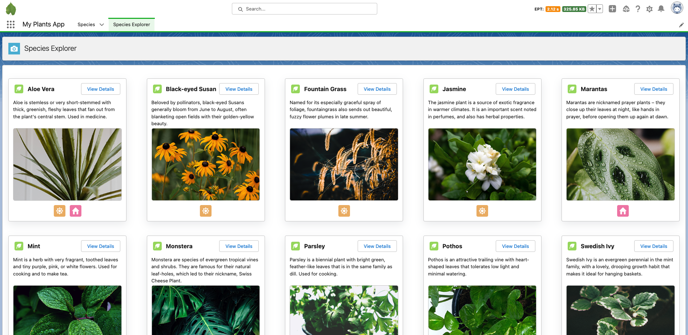

# TDX 23 LWC hack

## Add filters to a plant tracker

While having plants at home is lovely and helps fight climate change, taking care of plants can be sometimes hard. That’s why this repo contains an app that allows users to keep track of their plants and the care that they need in Salesforce. Let’s become greener 🌿!

Here comes your challenge! The list of species in the system can be long, and the user experience team has suggested that you, our awesome developer, add an input that allows filtering them.

Pre-work

To complete this mini hack, you can use any org of your choice. If you don’t have an org, request one here.

1. In the org that you chose or created, install [Code Builder](https://login.salesforce.com/packaging/installPackage.apexp?p0=04t6g000008b1LIAAY).

1. Open Code Builder from App launcher. When you’re prompted to link a repo, link https://github.com/developerforce/tdx23-lwc-hack

1. In Code Builder terminal, execute the following command. This will give you access to the app that you’ll work with, load same sample data, and retrieve in Code Builder the metadata files you’ll work with.

```
./setup.sh
```

Check everything is fine by opening the app called “My Plants”, going to the “Species Explorer” tab, and verifying you see this:



## Requirements

The business requirement says _“When a user types a value on a filter input, the speciesList component will show plants which `Name` or `Description__c` contains the typed value”_. There are two conditions indicated:

- The `speciesList` component should only change when the user has typed at least 3 characters.
- The returned species by filter value must be cached, to implement the page performance.

This is how the page needs to look like:
The rough steps to complete this challenge are:

- Create the filter using the `lightning-input` base component. [Here](https://developer.salesforce.com/docs/component-library/overview/components) you have the base component library.
- Import the existing Apex method `getFilteredSpecies` from the `SpeciesService` class into the `speciesList` component, instead of the one that’s being used. Check the [documentation](https://developer.salesforce.com/docs/component-library/documentation/en/lwc/lwc.apex) if you don’t know how to do it.
- Invoke `getFilteredSpecies` passing in the value that the user types on the `lightning-input` component. Remember this should only happen if the user wrote at least 3 characters, and that filtered species must be cached.
- Note: Remember to avoid caching issues while developing, you’ll have to activate Lightning Components debug mode.

Tip: if you don’t know how to deploy the code, try using [source commands](https://developer.salesforce.com/docs/atlas.en-us.sfdx_cli_reference.meta/sfdx_cli_reference/cli_reference_force_source.htm) on Code Builder terminal, or, alternatively, VSCode Salesforce extension pack commands that show up on the command palette or when right clicking a file. Remember in source tracked orgs (such as scratch orgs) you can use `push` and `pull`, while in non source tracked orgs (such as developer orgs) you’ll have to use `deploy` and `retrieve`.

Good luck with this green & sustainable challenge!
